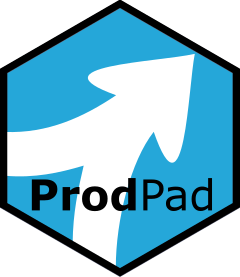

<!-- README.md is generated from README.Rmd. Please edit that file -->

```{r, include = FALSE}
knitr::opts_chunk$set(
  collapse = TRUE,
  comment = "#>",
  fig.path = "man/figures/README-",
  out.width = "100%"
)
```

# prodpad 

<!-- badges: start -->
[](https://lifecycle.r-lib.org/articles/stages.html#experimental)
<!-- badges: end -->

The `prodpad` packages exposes higher level APIs to extract tibbles with ProdPad information (for example, products, feedback, ideas, etc.) from the ProdPad API.

In addition, `prodpad` provides a low level wrapper around the ProdPad API - the `pp()` function.


## Installation

You can install the development version of prodpad from [GitHub](https://github.com/) with:

``` r
# install.packages("remotes")
remotes::install_github("andrie/prodpad")
```

## Authenticating against the API

To get started, you need a ProdPad API key. This can be found by going to:
[Profile => API Keys](https://app.prodpad.com/me/apikeys). (Or use
`prodpad::browse_api_key()` to navigate there interactively)

Then export that API key as an environment variable, e.g. in `.Renviron`:

``` bash
PRODPAD_API_KEY=my-api-key
```


## Example

This is a basic example which shows you how to solve a common problem:

``` r
library(prodpad)
pp_get_products()
```

## Acknowledgements

Cole Arendt also wrote a `prodpad` [package](https://github.com/colearendt/prodpad), using R6 classes to represent the connection to Prodpad. However, this implementation was inspired by the `gh` [package](https://github.com/r-lib/gh) by Gábor Csárdi. I found the ideas of `gh` to be more flexible and ported `gh` in its entirety to the `pp()` function in `prodpad`.

## Trademarks

The ProdPad name and logo are trademarks of ProdPad (CreateSHIFT Ltd.).  The author of this package has no affiliation with ProdPad.

